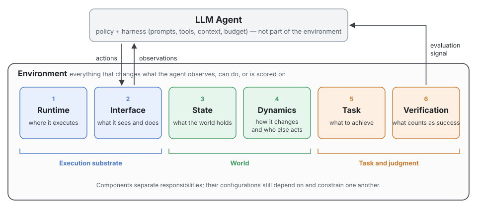

# Awesome Agentic Environments [](https://awesome.re)

<p align="left">
  
  <a href="https://github.com/TraceLite-AI/Awesome-Agentic-Environments/stargazers"></a>
  <a href="https://github.com/TraceLite-AI/Awesome-Agentic-Environments/commits/main"></a>
  <a href="https://github.com/TraceLite-AI/Awesome-Agentic-Environments/pulls"></a>
  <a href="LICENSE"></a>
</p>

A curated list of work on the **environments** that LLM agents are trained and evaluated in — organized by what an environment is made of, what changes when an environment changes, and how to report it.

This repository accompanies the survey ***Environments for LLM Agents: A Survey of Design, Effects, and Evidence*** (in preparation).

## 🔥 News

- **[2026-10]** Repository restructured around the six-component framework (Runtime → Interface → State → Dynamics → Task → Verification). Entries are being migrated into the new lists.

## Overview

**What we mean by an environment.** Relative to the agent under study, an environment is the external interactive system that hosts a task, together with its task and evaluation conventions. It fixes what goal and external state the agent faces, what it can observe and do, how the world changes in response to actions and events, how the interaction is executed, and how the result is judged.

**Admission test.** A component belongs to the environment if changing it changes what the agent can observe, what actions are available, or how the agent is scored. Anything that can be swapped without rebuilding the environment — prompts, tool selection, context management, orchestration, step or token budgets — belongs to the **harness**. The trainer, which only consumes trajectories and evaluation signals, is outside the environment as well. The environment decides which channels are *offered*; the harness decides which channel is *used*.

<p align="center">
  
</p>

| # | Component | Question it answers | Example sub-dimensions |
|---|---|---|---|
| 1 | [Runtime](#1-runtime) | Where does the interaction execute? | isolation backend, lifecycle (reset / snapshot / fork), OS and software stack, network and permissions, concurrency |
| 2 | [Interface](#2-interface) | What can the agent observe and do? | observation channels, action space and granularity, return formats and error semantics, protocols |
| 3 | [State](#3-state) | What does the world hold? | initial state and its distribution, residue and contamination, external data snapshots, persistence scope |
| 4 | [Dynamics](#4-dynamics) | How does the world change, and who else acts? | transition rules, stochasticity, time and async events, external service behavior; users, partners, opponents |
| 5 | [Task](#5-task) | What is the agent asked to achieve? | goal and constraints, structure and horizon, task source (real / programmatic / model-generated), difficulty |
| 6 | [Verification](#6-verification) | What counts as success? | judged object (output / final state / trajectory), verifier form, signal type, reliability checks, exploit resistance |

**How to read this list.**

- *Looking for designs and implementations?* Start from [Part I](#-part-i--papers-by-component), organized by component, and the [benchmark lists](#-benchmarks-and-trainable-environments) organized by domain.
- *Want to know which environment differences actually change results?* Go to [Part II](#-part-ii--what-environment-differences-change).
- *Building or reporting an environment?* Use the declaration template and comparison protocol in [Part III](#-part-iii--environment-declaration-and-comparison-protocol).

## Contents

- [Part I · Papers by Component](#-part-i--papers-by-component)
  - [1 Runtime](#1-runtime) · [2 Interface](#2-interface) · [3 State](#3-state) · [4 Dynamics](#4-dynamics) · [5 Task](#5-task) · [6 Verification](#6-verification) · [7 Lifecycle](#7-lifecycle-synthesis-evolution-and-delivery)
- [Environment Recipes in Foundation-Model Reports](#-environment-recipes-in-foundation-model-reports)
- [Benchmarks and Trainable Environments](#-benchmarks-and-trainable-environments)
- [Part II · What Environment Differences Change](#-part-ii--what-environment-differences-change)
- [Part III · Environment Declaration and Comparison Protocol](#-part-iii--environment-declaration-and-comparison-protocol)
- [Infrastructure and Tools](#-infrastructure-and-tools)
- [Related Surveys and Resources](#-related-surveys-and-resources)
- [Contributing](#-contributing) · [Citation](#-citation)

---

**Entry format.** `(Venue'YY) Title [[Paper]] [[Code]]` followed by badges.

- **Domain** —        
- **Type** —     ·  not yet checked against the source

---

## 📜 Part I · Papers by Component

A work is listed under every component it contributes to.

### 1 Runtime

*Execution backend and isolation · lifecycle (create / reset / snapshot / restore / fork) · platform and software configuration · execution boundary (network, identity, permissions) · concurrency · image building and maintenance.*

- (arXiv'26) DeepSeek Elastic Compute (DSec): A Sandbox Infrastructure for Effective Agentic Training at Scale [[Paper]](https://arxiv.org/abs/2609.22978)   

### 2 Interface

*Observation space and visibility · action space and granularity · interaction contract (arguments, return formats, error semantics, sync / async) · display and input configuration · protocols and adapters.*

- (NeurIPS'24) OSWorld: Benchmarking Multimodal Agents for Open-Ended Tasks in Real Computer Environments [[Paper]](https://arxiv.org/abs/2404.07972) [[Code]](https://github.com/xlang-ai/OSWorld)   

### 3 State

*State objects and representation · true state vs. observable projection · initial state and its distribution · residue and contamination · external data and snapshots · persistence scope.*

- (NeurIPS'24) OSWorld: Benchmarking Multimodal Agents for Open-Ended Tasks in Real Computer Environments [[Paper]](https://arxiv.org/abs/2404.07972) [[Code]](https://github.com/xlang-ai/OSWorld)   

### 4 Dynamics

*Transition rules and side effects · determinism and stochasticity · time and concurrency · external service behavior · actors (users, partners, opponents, humans in the loop) · implementation (real system, programmatic simulation, learned world model, hybrid).*

#### Passive dynamics

_Entries being migrated._

#### Actors

- (arXiv'25) τ²-Bench: Evaluating Conversational Agents in a Dual-Control Environment [[Paper]](https://arxiv.org/abs/2506.07982) [[Code]](https://github.com/sierra-research/tau2-bench)  

### 5 Task

*Goal, inputs and constraints · structure, dependencies and horizon · task distribution and difficulty · task source (real / programmatic / model-generated) · quality control.*

- (arXiv'26) GLM-5: from Vibe Coding to Agentic Engineering [[Paper]](https://arxiv.org/abs/2602.15763) [[Code]](https://github.com/zai-org/GLM-5)  

### 6 Verification

*Judged object and timing · verifier form (tests, rules, rubrics, state checks, model judges, humans) · signal form and use · reliability checks · exploit resistance and audit.*

- (arXiv'26) GLM-5: from Vibe Coding to Agentic Engineering [[Paper]](https://arxiv.org/abs/2602.15763) [[Code]](https://github.com/zai-org/GLM-5)  

### 7 Lifecycle: synthesis, evolution, and delivery

*Joint synthesis of tasks, states and verifiers · difficulty- or weakness-driven evolution · packaging, versioning and hubs.*

_Entries being migrated._

---

## 🏭 Environment Recipes in Foundation-Model Reports

Scale is quoted as reported, **with its unit**. Environments, tasks, images, concurrent sandboxes and cumulative sandboxes are not comparable to one another.

| Model | Org | Date | Disclosed environment scale (unit) | Links |
|---|---|---|---|---|
| GLM-5 | Zhipu AI | 2026.02 | >10K verifiable SWE environments · thousands of terminal environments · >2M web pages (search corpus) | [[Paper]](https://arxiv.org/abs/2602.15763) §4.2 · [[Code]](https://github.com/zai-org/GLM-5) |

---

## 📊 Benchmarks and Trainable Environments

### Code and software engineering

_Entries being migrated._

### Web and search

_Entries being migrated._

### GUI and computer use

- (NeurIPS'24) OSWorld: Benchmarking Multimodal Agents for Open-Ended Tasks in Real Computer Environments [[Paper]](https://arxiv.org/abs/2404.07972) [[Code]](https://github.com/xlang-ai/OSWorld)   

### Tools, APIs and simulated users

- (arXiv'25) τ²-Bench: Evaluating Conversational Agents in a Dual-Control Environment [[Paper]](https://arxiv.org/abs/2506.07982) [[Code]](https://github.com/sierra-research/tau2-bench)  

### Games and puzzles

_Entries being migrated._

### Science and ML research

_Entries being migrated._

### Embodied and world models

_Entries being migrated._

### Multi-agent and social

_Entries being migrated._

---

## 🧪 Part II · What Environment Differences Change

Findings where an environment condition was changed and an outcome was measured. A design that merely *supports* a condition is not listed here.
Outcomes: feasible strategies · difficulty and cost · verification result · capability attribution · learning and transfer.
Evidence: **controlled** (same tasks, one condition varied) · **observational** · **adjacent-field** (non-agent evidence) · **claim-only**.

| Changed condition | Component | Outcome | Finding (as reported) | Evidence | Source |
|---|---|---|---|---|---|
| Ubuntu → Windows, 43 adapted tasks, GPT-4V screenshot-only | Runtime · OS | difficulty | Success rate 4.88% → 2.55%; per-task correlation 0.7, read by the authors as good cross-OS transfer | controlled | [OSWorld](https://arxiv.org/abs/2404.07972) §5.3 |
| No-user → dual-control, telecom domain | Dynamics · actors | difficulty | pass^1 drops by 18% (gpt-4.1) and 25% (o4-mini) | controlled | [τ²-Bench](https://arxiv.org/abs/2506.07982) |

Sub-dimensions with no controlled evidence found so far will be listed explicitly rather than omitted.

---

## 📐 Part III · Environment Declaration and Comparison Protocol

Coverage and disclosure findings from the survey's coding study will be added here when the analysis is complete.

<details>
<summary><b>Environment declaration template</b> (six components)</summary>

Fill one declaration per environment version and configuration. Every value needs a source (paper section, or code path and commit). Use `unspecified` when the material does not say, and `n/a` only when the field has no meaning for the object; absence in code is `unspecified`, not `none`. Record the model, harness and budget separately — they are not part of the environment.

```yaml
object:            # environment family / version / configuration
sources:           # papers, code (commit), docs consulted
filled_by:         # authors or third party

runtime:
  backend:         # function call / process / container / microVM / full VM / emulator
  lifecycle:       # reset, snapshot, restore, fork; stateless / ephemeral / persistent
  platform:        # arch, OS and version, file-system semantics
  software:        # language runtimes, dependencies, shell, image digest or tag
  context:         # encoding, locale, time zone, clock, run-as identity
  boundary:        # network policy, permissions, mounts, devices, resource quotas
interface:
  observations:    # channels offered (terminal, screenshot, a11y tree, DOM, API returns)
  actions:         # action space and granularity
  contract:        # return formats, error semantics, sync / async
  display_input:   # resolution, scaling, UI language, input method
state:
  initial:         # initial state and how it is sampled
  residue:         # leftover files, processes, caches across tasks
  external_data:   # data versions and snapshots
  persistence:     # across calls / episodes / sessions
dynamics:
  transitions:     # rules, side effects, reversibility
  randomness:      # controlled seeds vs uncontrolled sources
  time_events:     # time advance, async events
  services:        # external services: frozen / live / simulated
  actors:          # users and other agents: none / simulated (persona) / human
task:
  goal:            # goal, constraints, termination
  source:          # real / programmatic / model-generated
  distribution:    # domains, difficulty, horizon
verification:
  form:            # tests / rules / rubric / state check / model judge / human
  signal:          # binary / scalar / multi-dimensional; visibility to the agent
  checks:          # reference solution, no-op, hidden tests, audit

agent_side:        # recorded separately: model, harness, budget
repeat_policy:     # number of runs per configuration
```

</details>

<details>
<summary><b>Comparison protocol</b> (default procedure and when to deviate)</summary>

1. **Pin everything else.** Hold all other components at a declared configuration (image digest, data snapshot, verifier version).
2. **Measure the noise floor.** Repeat runs within one configuration before attributing any difference to an environment change.
3. **Screen main effects.** Change one condition at a time from the base configuration (star / Morris-style screening).
4. **Explore combinations.** Use a constrained 2-way covering array over feasible configurations to surface pairwise failures; covering arrays find combinations but do not by themselves estimate interaction effects.
5. **Report per condition.** Success rate, effect size, outcome flips, time and cost, failure signatures and uncertainty — per condition, not as a single aggregate score.

Deviate when conditions are numeric (use sensitivity analysis), when interactions must be estimated (use a factorial design with stated identifiability assumptions), or when the budget allows only a tiered subset.

</details>

### Case studies

_To be added: cross-platform attribution, verifier audits, and run-to-run variation._

---

## 💻 Infrastructure and Tools

### Interface standards and packaging

_Entries being migrated._

### Environment hubs

_Entries being migrated._

### Sandbox platforms

- (arXiv'26) DeepSeek Elastic Compute (DSec): A Sandbox Infrastructure for Effective Agentic Training at Scale [[Paper]](https://arxiv.org/abs/2609.22978)   

### Training frameworks

_Entries being migrated._

---

## 📚 Related Surveys and Resources

- (arXiv'26) Agentic Environment Engineering for Large Language Models: A Survey of Environment Modeling, Synthesis, Evaluation, and Application [[Paper]](https://arxiv.org/abs/2606.12191)

---

## 🤝 Contributing

Contributions are welcome via issues or pull requests. Please check the original source before submitting.

- **Add a paper** — one line in the entry format above, under each component it contributes to, with domain and type badges.
- **Add an effect** — the changed condition, the component, the outcome, the finding with its original numbers, the evidence type, and where it appears in the source.
- **Correct an entry** — the line, the proposed change, and the source supporting it.

Entries that could not be checked against the original source carry the  badge until verified.

## 📖 Citation

The survey is in preparation. A BibTeX entry will be added here when it is released.

## License

Apache-2.0. See [LICENSE](LICENSE).

## ⭐ Star History

[](https://star-history.com/#TraceLite-AI/Awesome-Agentic-Environments&Date)
