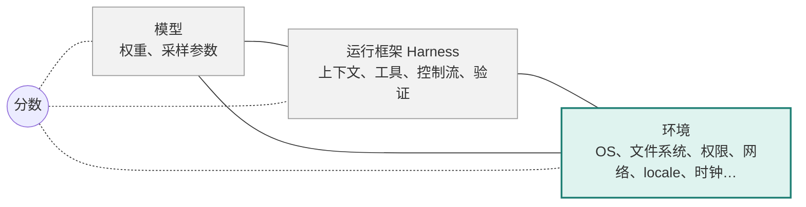

# 环境是什么：AI Agent 执行环境的拆解方法与坐标空间

## 综述与提案（v3.0 草稿，2026-09-24）

> 体裁：综述加提案。第 3 章梳理五个社区如何使用"环境"一词，并指出共同的空缺。第 4 章给出拆解环境维度的方法，这是本文的核心。第 5 章用文献证据检验这套拆解的效度。第 6 章把拆解结果做成一页纸的环境卡片和测量协议。第 7 章用卡片回填六个现有对象。所有引用均逐篇打开原文核对，数字来自原文。本文不包含作者团队未发表的实验结果。

---

## 摘要

Agent 评测的结果是模型、运行框架、环境三者共同决定的。近期三篇 harness 综述都承认这一点，也都定义了前两项，但第三项都停在"沙箱"这个词上 [75][76][77]。本文回答一个具体问题：环境有哪些维度会改变一道任务的正确解法，怎样把它们拆出来。

我们先梳理五个社区对"环境"的用法。Agent benchmark 把环境当常量，17 个主流 benchmark 没有一个声明镜像 digest。强化学习基础设施把环境当带旋钮的沙箱，暴露了网络、权限、隔离级别，但没有旋钮的语义。机器学习的不变性研究把环境当"答案不该随之变"的干扰，准入条件与执行环境正好相反。软件工程三十年前就把配置空间当因子的笛卡尔积，用组合测试给出了测量预算。机器人学习则把动力学参数当"答案随之变"的因子，用系统辨识让策略先探测环境再行动。

在此基础上，本文提出一套拆解方法。环境是策略之外、能改变合法成功路径集合的一切。一个候选因子能否成为轴，由四步检验决定。只改变成本的旋钮排除在外。每根轴下配接触面、机制和装置读数。第一版拆出五组 22 个因子 74 个取值。我们从四个方向检验这套拆解的效度：文献编目的环境依赖失败能否落进因子，每个取值有没有外部记录的案例，因子之间是否冗余，两个独立填写人填同一批卡片的一致率。

两句话概括本文：干扰因子测的是脆弱性，改机制因子测的是正确性，两者不能混报；论文不是环境，代码才是，很多坐标只存在于 Dockerfile 里。

---

## 1 引言

三个数字说明问题。OSWorld 把 43 道 Ubuntu 任务原样搬到 Windows，通过率从 4.88% 降到 2.55% [5]。MacArena 把 OSWorld 的任务集原样搬到 macOS，三个模型分别下降 3.23、9.26、9.84 个百分点 [17]。Anthropic 报告，只改基础设施配置就能让 agentic coding 评测分数移动 6 个百分点 [78]。任务一个字都没改，分数变了。

变的是环境。但"环境"这个词现在有五种用法，互不兼容。Agent benchmark 说"我们提供了可复现的环境"，指一个固定的容器。基础设施说"我们每天跑三百万个环境"，指沙箱实例。机器学习说"模型应对环境不变"，指数据采集条件。软件工程说"CI 矩阵覆盖了所有环境"，指配置的笛卡尔积。机器人说"在随机化的环境里训练"，指物理模拟器的参数。

五种用法都绕开同一个问题：**哪些环境因素会改变一道任务的正确解法**。Benchmark 不问，因为环境是常量。基础设施不问，因为旋钮只关乎资源和安全。不变性研究问的是反问题。软件工程有方法没对象。机器人最接近，但对象是物理量不是软件环境。

近期三篇 harness 综述把这个空缺说得很清楚。Meng 等写道，测得的性能是"（agent，harness，environment）三元组的性质"，然后用一百页定义 harness [75]。Li 等把执行环境定义为沙箱，按隔离技术分七类，在开放问题里停下来："macOS、Windows、浏览器、桌面暴露不同的可复现约束" [77]。Guo 等则直接把环境当已控制的背景 [76]。三元组的第三项没有坐标。

**图 1：一次评测运行的三元组。** 分数是三者共同的函数，任何一项要单独说，另外两项必须钉住。



三篇 harness 综述定义的是左边两项 [75][76][77]；本文定义右边那一项。第 4.2 节说明三者的边界怎么划、什么时候 harness 算环境。

本文分三步补这一项。

- **Claim 1**：五个社区的用法可以放进同一张对照表，空缺具体在哪一格能看见（第 3 章）。
- **Claim 2**：有一套可执行的拆解方法能把环境拆成有限根轴，产物是五组 22 个因子 74 个取值（第 4 章）。
- **Claim 3**：这套拆解的效度可以用文献证据检验，不需要新实验（第 5 章）。

第 6 章把拆解结果做成环境卡片和测量协议。第 7 章回填六个现有 benchmark 与平台。第 8 章列开放问题。

两句话贯穿全文。第一句：**干扰因子测脆弱性，改机制因子测正确性**。第二句：**论文不是环境，代码才是**。

---

## 2 方法

**检索。** 2026 年 9 月 23 日，沿四条线检索：Agent benchmark 的环境规格、RL 基础设施与产业、机器学习中的 environment 概念、软件工程的配置空间与组合测试。9 月 24 日补第五条线：机器人与世界模型。检索词、来源和日期记录在附录 C。

**纳入。** 一篇文献进入本文的条件只有一个：打开过原文（arXiv 摘要页或 PDF、官方仓库、官方博客），并记录打开的 URL。搜索摘要里看到但没打开的，不引用。付费墙后没看到正文的，标"部分未核"。

**编码。** 第 3 章的覆盖表由一人填写、作者审核。第 7 章的六张环境卡片由一人从论文和官方代码填写，另一人独立重填，一致率在第 5.4 节报告。表格里的空格统一用四种状态：已声明、所查来源未声明、不适用、尚未核验。

**局限。** 语料偏向英文、arXiv 和 GitHub 可见的工作。企业内部系统只有公开博客能看到的部分。Coding agent 的材料最丰富，因此被过度代表。"未声明"指在我们打开的材料里没找到，不等于作者没做。

---

# 第一部分 五种用法与共同空缺

## 3 五个社区里的"环境"

本章每一节末尾回答同一个问题："这个社区对'哪些因素改变正确解'的回答是什么"。五个回答拼起来就是 Claim 1 的证据。

### 3.1 Agent benchmark：环境是常量

我们逐篇核对了 17 个主流 Agent benchmark。表 A 列出每个 benchmark 对环境因子的声明程度。

| Benchmark | OS 与版本 | 隔离 / 镜像 | 镜像 digest | 网络 | 权限 | locale / 时区 | 观测通道 | 硬件 | 同一任务跨 OS 测量 |
|---|---|---|---|---|---|---|---|---|---|
| SWE-bench [1] | — | 固 conda 后改 Docker | — | — | — | — | 终端 | — | 无 |
| SWE-bench Verified [2] | Linux（Epoch 复现） | 固 Docker | — | 固 禁网（Epoch） | — | — | 终端 | — | 无 |
| SWE-bench Multimodal [3] | — | 固 Docker + Node + Chrome | — | — | — | — | 终端 + 无头浏览器 | — | 无 |
| Terminal-Bench [4] | —（Docker，隐含 Linux） | 固 Docker | —（pin 包版本，apt 包不 pin） | 固 允许联网 | — | — | 终端 | —（局限中承认 CPU 架构影响） | 无 |
| OSWorld [5] | Ubuntu 22.04（附录）/ Windows / macOS，后两者无版本 | 固 VM 快照 | — | — | — | — | GUI | — | 43 道 Ubuntu 到 Windows：4.88% 对 2.55% |
| OSWorld-Verified [6] | Ubuntu / Windows | 固 AWS 镜像 | — | — | — | — | GUI | — | 无 |
| WebArena / VisualWebArena [7][8] | — | 固 Docker 自托管 | — | 固 离线 | — | — | 浏览器 | — | 无 |
| AgentBench [9] | Ubuntu Docker | 固 | — | — | — | — | 终端等 | — | 无 |
| τ-bench [10] | 无 OS | DB + API | — | — | — | — | 工具调用 | — | 无 |
| GAIA [11] | 无 | 活网 | — | 活网，承认衰减 | — | — | — | — | 无 |
| MLE-bench [12] | Ubuntu 20.04 | 固 Docker + sysbox | — | — | — | — | 终端 | 变：CPU-only / 标准 / 加 GPU | 无 |
| Windows Agent Arena [13] | Windows 11 | 固 Docker 内 VM | — | — | — | — | GUI | — | 2/3 任务从 OSWorld 移植，无数值对比 |
| AndroidWorld [14] | Android 13，Pixel 6 | 固 模拟器 | — | — | — | — | GUI | — | 无（变的是任务参数） |
| AppWorld [15] | 无 | 模拟 app | — | — | — | 固 时间冻结 | 代码 | — | 无 |
| TheAgentCompany [16] | — | 固 Docker 自托管 | — | 固 自托管 | — | — | 终端 + 浏览器 | — | 无 |
| MacArena [17] | macOS，UTM VM | 固 VM | — | — | — | — | GUI | — | 同 OSWorld 题集 Linux 到 macOS：三个模型分别降 3.2、9.3、9.8 个百分点 |

表里有四列几乎全空。**digest 列全空**：没有一篇给出镜像的内容哈希。Terminal-Bench 要求 pin 包版本，却规定 apt 包"不得 pin" [4]。**权限列全空**。**locale 列**只有 AppWorld 冻结了时间 [15]，macOSWorld 变了界面语言 [18]。**硬件列**只有 MLE-bench 把计算预算当变量 [12]。

环境从不作为自变量。AndroidWorld 变的是任务参数 [14]。τ-bench 和 Terminal-Bench 变的是重复次数 [10][4]。唯一的例外是 macOSWorld 的界面语言轴，阿拉伯语平均下降 28.8% [18]。

同一任务跨 OS 的测量只在 GUI 领域出现过两次，样本都小。OSWorld 搬了 43 道题 [5]。MacArena 搬了整个任务集，作者的结论是"高分可能反映的是对任务分布的熟悉，不是跨平台能力" [17]。Coding 与终端领域，我们经过七轮检索没有找到任何一篇。Terminal-Bench 在局限里承认"机器资源与容器运行时差异会导致有效任务环境不同" [4]，但没有处理。

形式定义要么缺席，要么是 POMDP 元组。WebArena 写成 ⟨S, A, O, T⟩ [7]。这个定义在数学上完整，但操作系统被吸收进转移函数 T 里，而 T 从来不是被测量的对象。

**本节的回答**：不回答。环境被钉死，钉死的环境是一个没有坐标的点。

### 3.2 RL 基础设施与产业：环境是旋钮

训练 Agent 要按批创建成千上万个隔离环境。表 B 列出主要平台暴露的参数。

| 平台 | OS 选择 | 隔离级别 | 镜像 / 分层 | 网络策略 | 用户 / 权限 | GPU | locale | 是否定义"哪些旋钮改变正确解" |
|---|---|---|---|---|---|---|---|---|
| DSec [19] | Linux 基础镜像；Android 完整 VM | FnCall / 容器 / microVM / 完整 VM | 三层：基础镜像 / 工作区 / 工具包 | 按服务 allowlist（如 npm 禁、pypi 允） | init_user | FnCall GPU | 无 | 否 |
| E2B [21] | Linux | Firecracker microVM | 模板 | allow / deny 列表 | 无 | — | 无 | 否 |
| Modal [22] | Linux | gVisor；VM beta | Image | 三档出站策略 | 无 | 有 | 无 | 否 |
| Daytona [23] | Linux / Windows / macOS | 容器 / VM | 镜像须带 tag 或 digest | allowlist / blockAll / proxy | root | NVIDIA / AMD，至 8 卡 | 无 | 否 |
| OpenAI Code Interpreter [24] | — | VM | — | — | — | — | 无 | 否 |
| Firecracker [20] | 仅 Linux 客户机 | microVM | — | 设备级限速 | jailer | — | 无 | 否 |

DSec 值得单看 [19]。它是公开的最大规模的 Agent 训练沙箱平台：一个集群单元约 160 个节点，每天约 300 万个沙箱。它把沙箱内容分成三层，基础镜像、工作区、工具包，各自独立版本化。DeepSeek Harness 就是一个工具包层。它记录了 Agent 通过非预期渠道取答案的行为：翻日志、伪造请求、覆盖 /bin/bash、扫端口找镜像站。论文的结论是"仅靠最终输出检查无法可靠地确定 Agent 是否按预期方式解决了任务"。

但 DSec 把这些框定为 reward hacking。它的示例 network_rules={"npm": False, "pypi": True} 已经说明了一件事：网络可达性会改变 Agent 能走的路。只是没有人把这句话说出来。

产业侧的定义同样停在旋钮。Epoch AI 的定义是"动作集合，加上决定动作效果的周边上下文" [26]。这是唯一在逻辑上容许"环境依赖正确性"的定义，但随后的讨论没有枚举因子。Mercor 的定义是"软件、任务、验证器"三件套 [27]。Scale AI 把 OS 写成"类 macOS 与 Windows 的环境" [28]，OS 是被复刻的外观。

经典强化学习有相反的盲区。Gymnasium 的接口只在 reset 时接受随机种子和选项 [29]，不规定 locale 之类的设置。Procgen 和 XLand 变的是关卡布局 [30][31]，发生在固定的模拟器内部。

**本节的回答**：旋钮存在，旋钮的语义不存在。

### 3.3 机器学习：干扰，还是干预

机器学习的不变性研究有严格的环境定义，方向和执行环境正好相反。

不变风险最小化把环境定义为"在不同条件下测量同一对随机变量"的数据集索引 [33]。不变预测器是"对所有环境同时最优的分类器"。不变因果预测把环境定义为"未知且不精确控制的干预"，并明确"不允许对目标变量的干预" [34]。因果表示学习把分布写成机制的乘积，环境变化就是少数机制被替换 [35]。

三篇的共同点：**合法的环境不改变正确预测器**。准入的条件是答案不变，测的是模型错误地变了多少。鲁棒性 benchmark 遵循同一逻辑。ImageNet-C 的腐蚀是保标签的 [36]。FormatSpread 研究"不应影响提示词解释"的格式特征，24% 的原子改动带来至少 5 个点的变化 [37]。

执行环境的轴相反。文件系统对文件名做归一化，Agent 按输入的字节找文件就找不到，正确解法结构性地变了。权限从 root 换成非 root 并锁定系统目录，装包路线从系统 pip 变成 venv。这些轴值得测，正是因为答案随之变。

于是有本文最重要的一条区分。**干扰因子**：正确输出对其不变，测量结果叫脆弱性。**改机制因子**：正确输出随其改变，测量结果叫正确性。混在一起报，就把"不该变的地方变了"和"该变的地方没变"算成同一个数。

这条线还给了两个先例。真正的全笛卡尔积只出现在合成数据：dSprites 六个生成因子共 737,280 种组合，每种恰好一次 [38]。按轴报数是共识：ImageNet-C 先算每类腐蚀的误差再平均 [36]，DomainBed 按域报 [39]，WILDS 按数据集选用平均或最坏群体等指标 [40]。

**本节的回答**：只准入答案不该变的因子。我们要的是答案真的变的因子，准入方向相反。

### 3.4 软件工程：方法早已存在

CI 矩阵就是笛卡尔积。GitHub Actions 文档写道"一个作业会为变量的每一种组合运行一次"，上限 256 个作业 [41]。

组合测试给了测量预算的理论。NIST 对四个真实系统的分析发现，医疗设备 97% 的故障两个条件以内触发，Mozilla 95% 三个以内，没有故障需要超过六个 [42]。这条交互规则让两两覆盖成为有依据的低成本设计。但 NIST 自己也写明，两两覆盖可能漏掉 10% 到 40% 的缺陷 [43]，它是预算不是保证。JHipster 把 2.6 万个配置全跑了一遍，35.7% 失败，两两采样找到大多数 [44]。

实验设计给了一次一因子的边界。Morris 的基本效应法让每个因子得到一个均值和一个标准差 [47]。Saltelli 证明一次一因子的采样点全落在内切超球里，三个因子时只占体积的一半 [48]，所以它构造上看不到交互。

经验 bug 研究告诉我们哪些轴该进。跨 OS 重跑 500 个 Python 项目的测试，11.2% 有 OS 依赖失败，文件与目录类占大头 [49]。Apache 项目测试代码的环境类误报中，61% 是操作系统差异 [50]。时区是日期时间 bug 的首要根因 [51]。

flaky 研究给了噪声底线。96% 的 flaky 测试与平台无关 [53]。以 95% 置信度判定一个测试不 flaky 需要约 170 次重跑 [54]。所以大量表观的环境效应其实是非确定性，归因前必须重复运行。

可复现构建给了"钉住"的操作定义。Nix 把环境做成声明输入的纯函数 [55]。六年前的软件包集合重建约 1.4 万个包，成功率 99.94% [56]。普通仓库违反版本 pin 规则的频率是专家集合的五倍 [57]。

**本节的回答**：有方法，没对象。组合测试的因子是软件自己的配置项，不是 Agent 面对的世界。

### 3.5 机器人与世界模型：模拟器

机器人学习十年来把两类环境因子分开处理，只是没有用这两个名字。

感知侧随机化，答案不变。域随机化 [32]、CAD2RL [60]、RCAN [61] 随机化纹理、光照、相机位姿。目标位置在所有渲染下一样，策略要学会对这些因子失明。

动力学侧随机化，答案改变。Peng 等每回合重新采样质量、阻尼、摩擦、增益 [62]。RMA 把环境写成 17 维向量 [64]。参数变了，同一个目标需要不同的力矩。策略的目标反过来：**把因子辨识出来**。RMA 用 50 步历史回归环境参数，去掉辨识模块后成功率崩溃。Dactyl 报告与方块交互 5 秒后，LSTM 隐状态能以 80% 准确率判断方块大小 [63]。UP-OSI 给出了性能随单个参数变化的响应曲线 [65]。

两篇综述 [66][67] 按"随机化哪个部件"分视觉和动力学，没有把不变与自适应的二分当组织原则。按轴报数的 benchmark 已经出现：THE COLOSSEUM 14 个扰动因子按因子报成功率 [68]，Factor World 11 个 [69]。

世界模型回答另一个问题。World Models [70]、DreamerV3 [71]、Genie [72][73]、UniSim [74] 把环境定义为学出来的动力学模型，评价指标是生成保真和迁移率。Genie 3 的"可提示世界事件"是自由文本的旋钮，不是轴。

**本节的回答**：动力学随机化是"改机制因子"最成熟的先例，系统辨识是"先探测再行动"的先例。但对象是物理量。

### 3.6 综合：空缺在哪一格

| 领域 | 环境是什么 | 因子结构 | 准入判据 | 报数方式 |
|---|---|---|---|---|
| Agent benchmark | 钉死的容器或 VM 快照 | 无，常量 | 无 | 单一分数 |
| RL 基础设施 | 带旋钮的沙箱 | 旋钮清单，无语义 | 资源、安全、兼容 | 无 |
| 经典 RL | 模拟器 + 种子 / 关卡 | 关卡内容 | 无 | 泛化分数 |
| 域随机化 | 渲染与动力学参数区间 | 参数积，采样 | 答案对其不变 | 去一因子消融 |
| 不变性与因果 | 干预后的分布索引 | 机制乘积，稀疏变动 | 不得干预目标 | 最坏情形；假设检验 |
| 鲁棒性 benchmark | 保标签扰动 | 类型乘强度的网格 | 答案不该变 | 每轴误差再平均；spread |
| 合成因子数据集 | 生成因子 | 全笛卡尔积 | 生成因子 | 每因子解耦分 |
| 软件工程组合测试 | 配置参数 | 因子积 + 覆盖数组 | 交互规则 | t-way 覆盖；每因子基本效应 |
| 机器人感知侧随机化 | 渲染参数 | 参数积，采样 | 答案对其不变 | 聚合成功率 |
| 机器人动力学随机化 + 系统辨识 | 物理参数向量 | 参数积，采样 | 答案随之改变，策略须辨识 | 参数响应曲线；有无辨识对比 |
| 世界模型 | 学出来的动力学模型 | 无命名因子 | 无 | 生成保真、迁移率 |

表 C 最后一行是本文的位置。它和其他行的差别集中在"准入判据"一列：只有本文和机器人的动力学随机化以"答案随之改变"准入。三篇 harness 综述没有进表 C，因为它们定义的不是环境而是三元组的另两项；它们与本文的关系在第 4.2 节讲。

一个需要交代的先例是 Contextual MDP [79] 和 CARL [80]。它们把环境动力学与奖励对一个 context 变量的依赖形式化，最优策略随 context 改变。这在数学上包含了本文的对象。差别在于：Contextual MDP 不规定 context 有哪些维度，也不给维度的准入判据；CARL 的 context 是物理模拟器的参数。本文做的是给 LLM Agent 的执行环境找出 context 的具体维度，并给出维度的准入程序。

据此把空缺收窄。在本文纳入的工作中，我们没有找到同时满足以下三条的框架：对象是 LLM Agent 的软件执行环境；给出因子的准入判据；给出因子的取值集合与钉住规则。这三条就是第 4 章要做的事。


---

# 第二部分 拆解方法

## 4 怎样把环境拆成维度

本章是全文的核心。它回答三个问题：环境的边界在哪，一个候选维度凭什么能进来，进来之后长什么样。

### 4.1 四个词先定义

后文反复用四个词，含义不同，先固定。

- **任务目标**：用户要求完成什么，什么结果算成功。同一任务在不同系统上可以要求相同的交付物。
- **正确输出**：满足任务目标的结果。它是否依赖环境，要逐类任务判断。
- **合法成功路径**：在当前环境和规则下能执行并达成目标的步骤序列。权限、网络、工具可用性可以让一条路径失效。
- **策略**：根据观察选择行动的方法。一个自适应策略可以在不同环境里走不同路径。

本文说"环境改变了正确解"，严格的意思是：**合法成功路径的集合发生了变化**。这个表述容纳三种情况。一条路径被禁止，例如非 root 下系统 pip 不可用。一条路径被替换，例如 dash 下 bashism 失效要改写。正确输出本身依赖环境，例如日期格式随 locale 变。它不要求变化是双向对称的。

### 4.2 三条原则

**原则一：环境是策略之外的一切，边界随测量目标移动。** 这条原则要先回答一个问题：策略是什么。一次评测运行有三个参与者，模型、运行框架、环境。分数是三者共同的函数。本文用三条规则处理它们的关系。

*规则一，三元组的分数不可分解，除非钉住两项。* 要说"模型能力"，必须钉住运行框架和环境。要说"环境效应"，必须钉住模型和运行框架。三篇 harness 综述都指出了这一点：Meng 等称测到的是三元组的性质，并提出"harness 透明性"作为钉住第二项的要求 [75]；Li 等说 harness 编码策略、执行基底执行策略 [77]；Guo 等说分数以运行时配置为条件 [76]。本文的环境卡片钉的是第三项。第二项的钉住由 harness 侧的声明完成，本文不重复那部分工作。两者合起来，模型的分数才能单独说。

*规则二，被测策略 π 是显式参数，边界随之移动。* 测模型时，运行框架属于环境：它的上下文压缩、工具结果截断、重试与超时策略都是"策略之外的一切"，要写进钉住清单。测运行框架时，模型属于钉住项，运行框架属于策略。同一个坐标系服务两种测量，只是 π 的边界不同。这就是为什么表 D 里没有 harness 轴：它不是环境的一根轴，它是环境和策略之间可移动的那条线。

*规则三，运行框架与环境有交互项，要单独报。* 一些 harness 机制和环境轴共用接触面。工具结果截断策略与 tty 轴都作用在命令输出上；路径处理逻辑与 fs 轴都作用在文件名上；网络重试策略与 net 轴都作用在可达性上。这类交互项按第 6.2 节两两覆盖的办法测，不能算进任何一方的主效应。第 8 章的"Harness 作为环境"是这条规则尚未解决的部分。

**原则二：环境无限维，只能投影。** "测全环境"是伪命题。我们选有限根轴观测，把没命名的维度冻结在一份清单里。一个**格**是一个坐标点加一份钉住清单。只有坐标不是格：说"Windows"不是格，说"windows-2022 镜像版本 X，注册表 HideFileExt=0，Harness 版本 Y"才是。

**原则三：改变路径的进，只改变成本的不进。** CPU 核数、内存、显存、磁盘配额、网速、时延、屏幕分辨率，这些改变的是完成任务的代价，不是完成任务的方法。本文暂不覆盖它们。我们承认边界有争议：内存阈值可能迫使外存处理，视口变化可能要求不同的交互步骤。这类情况在第 5.2 节按案例逐个判断，而不是一刀切。

### 4.3 候选从哪里来

候选因子有两个来源，互相独立。

第一个来源是**经验 bug 编目**。跨 OS 可移植问题的 24 个子类 [49]、测试代码环境类误报的分类 [50]、日期时间 bug 的根因 [51]、flaky 测试的原因分类 [53][54]。这些编目记录了软件在不同环境下真实翻车的地方。

第二个来源是**生产系统的旋钮**。DSec 的 network_rules、init_user、四种后端、三层镜像 [19]；Daytona 的 OS 选择、GPU、region [23]；Modal 的隔离级别和出站策略 [22]。这些旋钮是工程师觉得值得暴露的东西。

两个来源交叉：一个候选在 bug 编目里出现过，又在生产系统里是旋钮，它就很可能是轴。只在一边出现的，进候选区等检验。

### 4.4 四步检验

一根候选轴 A 能进入坐标空间，要过四步，每步可执行：

1. 存在任务 t，其正确解 s 在格 a 上通过。
2. 把 s 原样搬到格 b，b 与 a 只在 A 上不同，s 失败。
3. 格 b 上存在正确解 s′，s′ 与 s 在**结构上**是不同的做法。
4. 反向检查：s′ 搬回格 a 是否也失败或需要另一种做法。第四步不是必要条件，它只用来区分对称轴和单向限制轴。

第三步是关键。只满足"更省"不满足"不同做法"的是预算差异，按原则三出局。

举一个通过的例子。任务：处理带重音字母的文件名。Linux 格通过。搬到 macOS 格，文件系统对文件名做 Unicode 归一，按输入字节查找失败。macOS 上的正确解是先列目录再按归一化匹配，结构不同。反向：这个解搬回 Linux 也能用，所以 fs 是单向限制轴，不是对称轴。

举一个不通过的例子。任务：编译一个大项目。8 核格通过。搬到 2 核格，超时失败。2 核格上的正确解是同样的命令等更久，结构相同。CPU 核数出局。

### 4.5 每根轴长什么样

通过检验的轴还要有三层内部结构，否则测不了。

- **接触面**：轴与任务发生作用的面。操作系统轴有四个：文件系统，进程与 shell，编码区域时间，桌面惯例。
- **机制**：接触面上一条具体的行为差异。文件系统面上有大小写敏感、Unicode 归一、非法字符、路径长度、文件锁、可执行位。
- **装置读数**：证明这个格在这个机制上真的和基准格不同的观测。创建 a.txt 后读 A.txt 是否成功，就是大小写敏感的读数。

读数是标准的一部分。一个格声称在某轴上不同，必须拿出读数。**不能从分数反推机制**：分数掉了不等于机制被触发，可能是别的原因。附录 A 给出操作系统轴的完整规格书样板。

### 4.6 正交与约束

轴之间要求可以独立变化。做不到的组合不当轴，当"轴外自然点"。Ubuntu 20.04 天然捆绑 Python 3.8，这是一个自然点，用 OS 轴和运行时轴的测量去分解它。

第一版里三处需要明写。fs 和 os 不绑定：Linux 可以挂 casefold 文件系统，APFS 可以格式化成大小写敏感，所以 fs 是独立因子。toolchain 和 os 有约束：busybox 在 macOS 上没有原生实例，这类格标"不可行"。accel 为 none 时，toolkit、compute-cap、gpu-count 三个因子标"不适用"。

### 4.7 产物：五组 22 因子 74 值

按上面的程序，第一版拆出下表。星号为基准值。每个非基准值在第 5.2 节配一条外部案例，配不上的标为候选。

| 组 | 因子 | 取值 | 排除的近邻旋钮（预算类） |
|---|---|---|---|
| 硬件 | arch | x86_64 * / arm64 | CPU 核数 |
| 硬件 | accel | none * / nvidia（候选） / amd-rocm / apple-metal | 显存大小 |
| 硬件 | toolkit | matched * / driver-only / major-mismatch | |
| 硬件 | compute-cap | current * / old | |
| 硬件 | gpu-count | single * / multi | 独占 / 共享模式 |
| 系统 | os | linux * / macos / windows / android | 发行版与版本（钉住） |
| 系统 | fs | case-sensitive * / case-insensitive / unicode-normalizing | 磁盘配额 |
| 系统 | isolation | container * / microvm（候选） / vm（候选） / bare（候选） |  |
| 系统 | perm | root * / sudo-nopasswd / non-root / non-root+readonly-sys / restricted-caps | |
| 系统 | mount | normal * / tmp-noexec | |
| 运行时栈 | stack-version | current * / old | 相对任务声明的栈 |
| 运行时栈 | entry-name | canonical * / alias-missing | 相对任务声明的栈 |
| 运行时栈 | build-tools | present * / absent | 相对任务声明的栈 |
| 运行时栈 | toolchain | gnu * / busybox / bsd | |
| 运行时栈 | shell | bash * / dash / zsh / powershell / cmd | |
| 运行时栈 | browser-engine | chromium * / firefox / webkit（候选） | 仅网页类任务 |
| 策略可见面 | channel | terminal * / gui（候选） / a11y-tree / web-dom | 屏幕分辨率 |
| 策略可见面 | tty | tty * / no-tty | 终端列数 |
| 外部世界 | net | online * / offline / allowlist / proxy-required / ipv6-only | 网速、时延 |
| 外部世界 | locale | C.UTF-8 * / C / en_US.UTF-8 / de_DE.UTF-8 / tr_TR.UTF-8 / zh_CN.GBK / cp1252 | |
| 外部世界 | tz | UTC * / Asia/Shanghai（候选） / Europe/Berlin / Asia/Kolkata |  |

计数：22 个因子，74 个取值。星形设计（基准格加每根轴走一步）为 1 + Σ(取值数 − 1) = 53 格。这是形式计数，未扣除第 4.6 节的不可行组合。全因子约 10¹⁰ 量级，只定义不跑。

第 5.1 节的覆盖测试提出了三个第二版候选因子，暂不入表：installed-packages，系统库与字体是否存在；limit-enforcement，限额是保证分配还是宽松超分；external-state，任务依赖的第三方服务处于哪个时点的状态。它们要按第 4.4 节走一遍检验。

三条配套规则。**取值按任务参数化**：运行时栈的值相对于任务声明的技术栈解释，Python 任务的 old 是 3.8，Node 任务的 old 是 18。**基准格按任务族定义**：GPU 任务从 nvidia 出发，普通任务从 none 出发。**核心与候选分开**：一个取值有外部记录的案例才进核心，否则在候选区。新因子走同一条路。


---

# 第三部分 效度证据

## 5 这套拆解站得住吗

分类法不能被证明，只能沿几个效度维度给证据。本章给四项，都不依赖作者的实验。

### 5.1 覆盖效度：文献编目的失败能否落进因子

**测试集。** 九个来源，134 个叶子类别，全部是别人编好的目录，不是我们挑的案例：跨 OS 可移植问题的 24 个子类 [49]；测试代码 bug 的环境类误报 [50]；日期时间 bug 的根因与概念类 [51]；Python flaky 测试的原因 [54]；flaky 综述的原因表 [53]；DSec 第 6.4 节的 11 个实例 [19]；Terminal-Bench 的局限与附录 [4]；OSWorld-Verified 修复的问题类型 [6]；Anthropic 基础设施噪声实验 [78]；agentic 评测随机性来源 [81]。其中 [49][51][54][78][81] 在造因子时没有读过。

**规则。** 每个类别只贴一个标签：某个因子；"排除，预算类"；"非环境"，即模型、harness、任务或判官造成；"未映射"，即环境原因但没有因子接得住。

**结果。**

| 标签 | 类别数 |
|---|---|
| 映射到某个因子 | 59 |
| 排除，预算类 | 17 |
| 非环境 | 46 |
| 未映射 | 12 |

命中率按"映射 / (映射 + 未映射)"算，为 59/71 = 0.83。去掉一条没有描述的残差桶后 0.84。再去掉三条不可设置的噪声项（运行时序非确定性、集群健康、基础设施可靠性）后 0.88。

按因子看，os 吃了 19 条，net 10 条，perm、tz、clock 各 5 条，fs 4 条。这个分布说明文献编目大多停在"操作系统"这一层，我们拆得更细的 fs、shell、locale 拿到的条目少。九个因子零命中：硬件组五个，mount、entry-name、build-tools、toolchain、browser-engine。原因是测试集里没有 GPU 或工具链方面的研究，这是测试集的局限，不能反推这些因子无用。

**残差。** 12 条未映射收成四个候选因子和两条其他：

- **installed-packages**，系统库或字体缺失。跨 OS 研究里"缺库"有 13 个项目 [49]，OSWorld-Verified 修过字体安装 [6]。现有因子只管编译器在不在，不管系统包在不在。这是第一版最明显的漏洞。
- **limit-enforcement**，限额的执行语义。同样的名义配额，一种运行时保证分配、超了硬杀，另一种宽松超分。Terminal-Bench 把它列为局限 [4]，Anthropic 的数据显示它在名义预算不变时仍移动分数 [78]。所以它不是预算旋钮本身，是一个候选轴。
- **external-state**，任务依赖的第三方服务随时间漂移：网页改版、URL 演化 [6]。它随时间变，需要一个"时点"坐标。
- **infra-reliability**，瞬时的集群或 pod 故障。它不可设置，归噪声底线。
- 文件描述符上限，介于权限与预算之间，暂列预算。测试代码研究里一个没有描述的"其他"桶，无法归类。

**判断点。** 七处标签是判断，可以重标：文件锁归 os 不归 fs；二进制 wheel 不匹配归 arch；两条 I/O 分别归 fs 和预算；XFS ioctl 与 /proc 内核崩溃归 isolation；时限与并发归预算。重标最多让命中率在 0.80 到 0.85 之间移动，不改变结论。

### 5.2 准入效度：每个取值有没有外部案例

**规则。** 表 D 有 52 个非基准取值。每个取值找一条外部记录的案例，要求同时满足两点：基准值下的正确做法在这个值下失败有记录；这个值下的正确做法在结构上不同也有记录。两点都有记"强"，只有失败记录记"弱"，两轮检索找不到记"无"。来源只用打开过的官方文档、PEP、man page、bug tracker 或论文。完整的 52 行表在附录 D。

**结果。**

| 组 | 非基准取值 | 强 | 弱 | 无 |
|---|---|---|---|---|
| 硬件 | 8 | 7 | 1 | 0 |
| 系统 | 13 | 10 | 2 | 1 |
| 运行时栈 | 11 | 10 | 1 | 0 |
| 策略可见面 | 4 | 3 | 1 | 0 |
| 外部世界 | 16 | 15 | 1 | 0 |
| 合计 | 52 | 45 | 6 | 1 |

45 个取值有强案例。几个例子说明"结构上不同"是什么意思。BusyBox 的 find 没有 -empty 选项，正确做法是装 GNU findutils 或改写成 POSIX 管道。BSD 的 sed -i 要求一个备份后缀参数，GNU 写法会把脚本当成后缀，正确做法是 sed -i '' 。zsh 把方括号当通配，pip install napari[all] 报"no matches found"，正确做法是加引号。/tmp 挂了 noexec，pip 在 /tmp 暂存 wheel 时检查可执行位失败，正确做法是把 TMPDIR 指到可执行的文件系统。系统时钟拨快一年，apt 的 Release 文件和所有 TLS 证书都过期，只能校时或显式关闭时间检查。这些都不是"同一命令等更久"。

**降级。** 七个取值按规则降为候选，表 D 已标注：

| 取值 | 原因 |
|---|---|
| isolation=bare | 两轮检索无案例，找到的都是反方向，即容器内假设失效 |
| accel=nvidia | 基准到 nvidia 方向没有失败记录，CPU 版 wheel 只是不用 GPU；强案例在反方向 |
| isolation=microvm、vm | 都是设备没暴露，无直通、无嵌套 KVM，机制相同，替代做法只是隐含的 |
| browser-engine=webkit | 只有 Chromium 专有 API 的说明，具体失败已由 firefox 一行承担 |
| channel=gui | OSWorld 2.0 记录了失败类，界面移动导致过期点击，但不同的正确做法被写成开放问题 |
| tz=Asia/Shanghai | 机制在 Python 参考里，没有找到 issue，且被 Europe/Berlin 的夏令时案例覆盖 |

两对取值机制重复但各自都强。locale 的 cp1252 与 zh_CN.GBK 同属 PEP 597 的默认编码问题。clock 的 past-1y 与 future+1y 同属有效期窗口，只是符号相反。保留两者，注明它们不增加新的结构性做法。

**对第 4.3 节的反馈。** 硬件组 8 个取值 7 个强，来源全是 CUDA 兼容文档、PyTorch 版本页、NCCL 与 Firecracker 的 issue。这说明第 5.1 节硬件组零命中是测试集的问题：bug 编目里没有 GPU，工程文档里全是。

### 5.3 区分效度：因子是否冗余

两个因子冗余，指它们总是一起变，测一个等于测另一个。检查方法是对每对容易混淆的因子，找一个"一个变、另一个不变"的真实配置。

| 因子对 | 独立变化的证据 | 已知约束 |
|---|---|---|
| fs 与 os | Linux 可挂 casefold 目录，APFS 可格式化为大小写敏感；git 的 core.ignoreCase 和 core.precomposeUnicode 是按仓库探测的，不按 OS 定 | 默认值跟 OS 走，所以第 5.1 节的编目把文件锁归 os 而不归 fs |
| toolchain 与 os | Alpine 容器在 Linux 内核上用 BusyBox，Ubuntu 用 GNU；macOS 装 coreutils 后有 GNU 版本 | BusyBox 在 macOS、Windows 无原生实例，这些格标不可行 |
| shell 与 os | Ubuntu 的 /bin/sh 是 dash、交互 shell 是 bash；macOS 默认 zsh；Windows 有 cmd 与 PowerShell 两种 | 同一 OS 内可切换，是独立因子 |
| locale 与 os | 同一 Linux 镜像可设 C、C.UTF-8、de_DE；Windows 的 cp1252 也可改为 UTF-8 | cp1252 只在 Windows 出现，这一取值与 os 有约束 |
| toolkit、compute-cap、gpu-count 与 accel | 只有 accel 非 none 时才有意义 | accel=none 时三者标不适用 |
| tz 与 clock | 时区改变本地时间的解释，时钟偏移改变绝对时间；夏令时案例只需要 tz，证书过期案例只需要 clock | 两者可独立设置 |
| perm 与 mount | 非 root 不影响 /tmp 的 noexec；root 也受 noexec 约束 | 独立 |
| channel 与 tty | 终端通道可以有 pty 也可以是管道；GUI 通道下 tty 不适用 | 部分不适用 |

结论：第一版没有发现"总是一起变"的因子对。四组约束已在表 D 的"排除的近邻旋钮"列和第 4.6 节注明。第 5.1 节提出的候选因子里，limit-enforcement 与预算类旋钮的区分需要单独说明：Anthropic 的数据是在名义配额不变时改变执行语义，分数仍动 [78]，所以它不是配额的函数，是独立候选。

### 5.4 信度：两人独立填卡的一致率

**做法。** 第 7 章的六张卡片由填写人 A 从论文和官方代码填出。第二天，填写人 B 在不得查看 A 的卡片的条件下，用同样的材料独立重填。两人都只依据打开过的论文与代码。共 132 格，22 个因子乘 6 个对象。

**结果。**

| 口径 | 一致率 | Cohen's κ |
|---|---|---|
| 值层：状态相同且值语义相同，未声明与不适用合并为"未给值" | 115/132 = 0.87 | |
| 已声明 对 未给值，两分类 | 0.89 | 0.77 |
| 已声明、未声明、不适用，三分类 | 0.71 | 0.54 |

三分类的 κ 明显低，差距几乎全来自"不适用"与"未声明"的用法不同：B 对 τ-bench 和没有 GPU 的对象大量用不适用，A 用未声明。这是规则没写清，不是证据分歧。按对象看，WebArena 和 DSec 各 21/22，OSWorld 最低 16/22。

**17 处实质不一致分四类。**

| 类型 | 处数 | 例子 |
|---|---|---|
| 一方找到另一方漏掉的证据 | 5 | B 在 OSWorld 论文附录找到 Ubuntu 22.04；B 在 SWE-bench 代码里找到 django 的 LANG 导出；A 在 τ-bench 的政策文本里找到虚构时间 |
| 推断与严格之别 | 6 | A 从 ubuntu 基础镜像推断 GNU 工具链，从代码里没有挂载推断"无挂载"；B 一律记未声明 |
| 同一代码编码不同 | 2 | OSWorld 的 shell，A 记 subprocess 的 sh，B 记 bash，因为 run_bash 会前置 #!/bin/bash |
| 宿主还是客户机 | 4 | DSec 的 CPU 型号是宿主的，A 记了，B 认为不是 agent 的环境 |

**规则修订。** 四类不一致各对应一条规则，已写进第 6.1 节：不适用只用于因子对该对象无意义，并给判定例子；代码里"没有"不等于"声明为无"，一律记未声明，除非有显式配置；卡片描述 Agent 行动的环境，宿主信息另列；证据写到函数或文件级。第一类不一致是好事，两人合起来比一人填得全，合并后的卡片在第 7 章。

### 5.5 边界

覆盖效度的测试集来自文献，造因子时也用了文献。为避免循环，第 4.3 节造因子用的编目和第 5.1 节测试用的编目分开，测试集只用造因子时没有读过的来源。预测效度，即"未声明"多的 benchmark 是否跨环境更敏感，只有两三个数据点，本文不作为证据。


---

# 第四部分 交付与回填

## 6 环境卡片、测量协议、报数

拆解方法要被采用，采用成本必须低于它带来的信息。本章给三样交付物，按采用成本从低到高排。

### 6.1 环境卡片

Model Card 与 Datasheets for Datasets 的经验是：一页纸的填空表，作者花半小时填，审稿人花五分钟查。环境卡片照此设计，四块：

- **身份**：对象、版本、日期、填写人、依据材料。
- **坐标**：表 D 的 22 个因子，每个填一个值。允许三类值：命名取值；"未声明"，材料里找不到；"不适用"，因子对这个对象没有意义。每个值旁边写来源。**只填能指出来源的值。**
- **钉住清单**：镜像 digest 或 tag 及 pin 策略、包版本 pin 策略、运行框架版本、模型版本策略、快照 ID、系统设置导出。
- **变化与承认**：作者自己变化了哪些因子；作者承认了哪些环境敏感性，原句引用。

填写规则八条，前四条来自设计，后四条来自第 5.4 节两人填卡的不一致。

1. 值必须有出处。论文写了标"论文 §X"，只在代码里标"代码"，两处都有标"两者"。
2. "未声明"是信息不是缺点。一张全是未声明的卡片同样有用。
3. 卡片描述对象现在的状态，改进意见不写进去。
4. 第三方可以填，但要注明。原作者确认的卡片是最高等级。
5. "不适用"只用于因子对该对象无意义。τ-bench 没有执行环境，os 不适用；SWE-bench 是终端任务，browser-engine 不适用；没有 GPU 时 toolkit 不适用。
6. 代码里"没有"不等于"声明为无"。没有挂载配置记未声明，不记"无挂载"，除非有显式的空配置。
7. 卡片描述 Agent 行动的那个环境。宿主机器的 CPU 型号、评测脚本的解释器版本不填进坐标，另列。
8. 证据写到文件或函数。"README 说"不够，要写文件路径或章节号。

卡片不推翻已有定义，它给已有定义补坐标。WebArena 的 ⟨S, A, O, T⟩ 是坐标块的抽象形式 [7]。Epoch 的"周边上下文"就是坐标加钉住清单 [26]。Mercor 的"软件"是坐标的系统组和运行时栈组 [27]。模板与 JSON schema 在附录 B。

### 6.2 测量协议

卡片只要求声明。想测一个策略沿某根轴的敏感度，按下面做。

**任务准入两道门。** 门一：参考解在所有相关格上全过，证明每个格都可解。门二：朴素解只在靶子格失败，证明任务与该轴有真实接触面。先有轴再造题，不给旧题硬配轴。

**预算三层。** 第一层是星形：基准格加沿每根轴走一步，53 格。这是 Morris 基本效应的单基准点版本 [47]，给每根轴的主效应。第二层是两两覆盖数组。NIST 的交互规则说大多数故障两个条件以内触发 [42]。但同一机构的指南也说两两可能漏 10% 到 40% [43]。所以它是低成本的第二层预算，不是充分性保证。第三层是两三个轴外自然点，用前两层分解。

**重复运行是协议的一部分。** flaky 研究说明大量表观环境效应是非确定性 [53][54]。每格至少重复 n 次，先分离噪声，再归因到轴。

**探测步骤单独记。** 第 3.5 节的系统辨识提示了一种可测的行为。在改机制轴上，正确的策略应先探测自己处在哪个格，再决定做法。探测的材料是命令输出、报错、uname、which、locale。协议要记录策略有没有探测、探测的成本，把"写死了假设"和"没有去查"分开。

### 6.3 报数

对每个策略 m 和每根轴 i，报两个数。**离散差值** Δᵢ(m)：基准格通过率减去沿轴 i 走一步的通过率。对 OS 这类类别因子，它不是数学意义的导数，只是给定基准下的差值。**翻转率**：同一任务在两格结果不同的比例。交互项只在覆盖数组选定的轴对上报。

**总分要有条件才成立。** "Linux 好于 macOS 好于 Windows"这类排序是靶子分布的产物：多数任务的靶子落在哪个系统，哪个系统就吃亏。聚合分数只有在任务分布、权重、比较对象都写明的情况下才可比。默认按轴报，附"对照格持平"的健康检查。

**失败签名。** 每条判据挂一条"策略写死了什么假设"。挂掉的判据集合是签名，按策略汇总成假设画像。归因三问全是才归因："环境在该轴上真不同吗"看读数，"动作真依赖了该假设吗"看轨迹，"同格存在正确路线吗"看门一。第二问不成立是常见情况，例如任务要按名字找文件而 Agent 用图形对话框选中了它，机制没触发。这是干净的负结果。

## 7 六张环境卡片

### 7.1 怎么填的

六个对象：SWE-bench、Terminal-Bench、OSWorld、WebArena、τ-bench 四个 benchmark，DSec 一个训练平台。材料只有两类：论文原文，官方仓库里的 Dockerfile、配置、评测代码。SWE-bench 取评测框架 v4.1.0，2023 年的论文描述的是 conda 环境。Terminal-Bench 取 2.0 任务集与 Harbor 0.23.0。DSec 只有论文。完整卡片随本文发布，这里只给汇总表。

| 因子 | SWE-bench | Terminal-Bench | OSWorld | WebArena | τ-bench | DSec |
|---|---|---|---|---|---|---|
| arch | x86_64 强制（代码） | 跟随宿主 Docker，无 pin（代码） | 宿主决定 x86_64 / arm64（代码） | 未声明（推荐 t3a.xlarge） | 未声明 | AMD EPYC 9655 宿主（论文 §8.1） |
| accel | 无（代码） | 无：89 个 task.toml 均无 gpus 字段（代码） | 未声明 | 未声明 | 未声明 | GPU 容器 / virtio-gpu（论文） |
| toolkit | 未声明 | 未声明 | 未声明 | 未声明 | 未声明 | 未声明 |
| compute-cap | 未声明 | 未声明 | 未声明 | 未声明 | 未声明 | 未声明 |
| gpu-count | 0（代码） | 0，上限 1（代码） | 未声明 | 未声明 | 未声明 | 未声明 |
| os | ubuntu:22.04（代码） | 每题不同：python:3.13-slim-bookworm 41 题，ubuntu:24.04 40 题，其他 8 题（代码） | Ubuntu 22.04（论文附录 B.2）；Windows 10（代码/论文） | 未声明 | 未声明 | 宿主 Linux 7.0，客户机 6.1；Ubuntu 基础镜像；Android VM（论文） |
| fs | 未声明 | 未声明 | 未声明 | 未声明 | 未声明 | overlayfs + EROFS + ext4（论文 §5.2） |
| isolation | Docker 容器（代码） | Docker compose；论文用 Daytona | VM：VMware / VirtualBox / Docker 内 QEMU / 云（代码/论文） | 站点 Docker；浏览器在宿主裸跑（论文/代码） | 无，裸 Python 进程 | FnCall / QEMU 内容器 / Firecracker / QEMU VM（论文） |
| perm | root（代码） | root（代码） | `user` 带 sudo（README） | 未声明 | 未声明 | root，AppArmor 仍生效（论文） |
| mount | 无（代码） | 仅日志卷（代码） | qcow2 宿主侧只读（代码） | 无（论文 A.2） | 未声明 | 只读 EROFS 层 + 可写 overlay（论文） |
| stack-version | conda 按仓库×版本 pin（代码） | 每题镜像 tag（代码/论文） | 宿主 Python ≥3.10；客户机未声明 | Python 3.10；部分 pin（代码） | 未 pin，仅 `>=`（代码） | 按层版本化，无 pin（论文） |
| entry-name | python（代码） | 未声明，基础镜像不一 | python（代码，controllers/python.py） | python（代码） | python（代码） | 未声明 |
| build-tools | build-essential 等（代码） | 每题不同（代码） | 未声明 | 未声明 | 未声明 | 未声明 |
| toolchain | GNU（ubuntu 基础） | GNU（ubuntu/debian 基础） | 未声明 | 未声明 | 未声明 | 未声明 |
| shell | bash（代码） | tmux 内 bash（代码/论文） | subprocess 的 sh；设置用 bash -lc（代码） | 不适用 | 不适用 | chronus 的 bash（论文） |
| browser-engine | 不适用 | 不适用 | 客户机内 Chrome，版本未声明（代码） | Playwright 1.32.1 的 Chromium（代码） | 不适用 | 未声明 |
| channel | 无：补丁进、测试出 | 终端，tmux 窗格（代码/论文） | 截图 1920×1080 + a11y 树 / SoM（代码/论文） | a11y 树 / HTML / 截图，视口 1280×720（代码） | JSON 工具调用 + 模拟用户文本 | shell / 工具调用；GUI 走 VM（论文） |
| tty | 无 pty（代码） | tmux 提供 pty（代码） | 无 pty，HTTP + 管道（代码） | 不适用，无头浏览器 | 不适用 | 未声明 |
| net | 联网，默认桥接（代码） | 公网（论文/代码）；可选 allowlist / none | 联网；部分任务建议代理（README） | 联网；站点自托管，维基离线（论文/代码） | 仅 LLM API 联网 | eBPF 按题 allowlist（论文） |
| locale | 按仓库设置：django 导出 en_US.UTF-8，镜像级未设（代码） | 未声明 | 未声明 | 未声明 | 不适用 | 未声明 |
| tz | Etc/UTC（代码） | 未声明 | 未声明 | 未声明 | 虚构的 2024-05-15 15:00 EST（代码/论文） | 未声明 |

### 7.2 表里看不出来的三件事

**整列空白的因子和 bug 编目对得上。** toolkit、compute-cap 六家全部未声明或不适用；locale 只有 SWE-bench 在个别仓库的评测命令里导出。clock 除 τ-bench 外全未声明。tz 只有两处。第 3.4 节的编目说编码和时区是跨 OS 失败的主因，正好落在这几列。

**很多坐标只在代码里。** SWE-bench 的操作系统、运行用户、时区都只在 Dockerfile 生成代码里。WebArena 的 1280×720 视口和 Chromium 只在 envs.py 里。Terminal-Bench 的 bash 和 tmux 伪终端只在执行器里。读论文的人不知道这些坐标。两个团队"按论文复现"，可以在不同的格里跑。

**钉住清单全是 tag。** 六个对象没有一个用 digest。SWE-bench 默认拉 latest。Terminal-Bench 抽样的 12 个 Dockerfile 无一用 sha256。按第 3.4 节的可复现标准，这些格没有一个被 bit-for-bit 钉住。OSWorld 是半个例外，AMI 按 ID 钉住、快照每题回滚，但 VM 镜像按 URL 下载不校验哈希。

只有 OSWorld 的作者自己变过卡片上的因子。承认环境敏感性的是 Terminal-Bench、OSWorld 和 DSec。SWE-bench 的仓库文档反而写"容器化消除了环境差异"。

六张卡片由一人一天内从公开材料填出，没有联系原作者，没有运行代码。这是第 6.1 节"采用成本低于信息价值"的直接证据。

### 7.3 DSec 参数到轴的映射

| DSec 参数或机制 [19] | 对应的轴或钉住项 | 语义空缺 |
|---|---|---|
| 四种后端（FnCall / 容器 / microVM / 完整 VM） | isolation | 论文说"调用方自己负责选择后端"，未定义哪些任务的正确解依赖隔离级别 |
| network_rules={"npm": False, "pypi": True} | net=allowlist | 示例已隐含"网络可达性改变可走的路"，未明说 |
| init_user="root" | perm | 只作为安全设置 |
| 基础镜像（Ubuntu、Python 3.10、Java 8） | os + stack-version | 作为兼容性设置 |
| 工作区 / 工具包分层 | 钉住清单的三个 digest | 作为维护成本优化 |
| Android 完整 VM | os=android | 作为工作负载类别 |
| FnCall GPU 独占 / 共享 | 排除项（预算类） | 正确地未当作轴 |

基建层已经有了坐标系需要的全部旋钮，缺的只是语义层。一个标准只定义语义、不要求新基建，采用成本就低。

---

## 8 开放问题

**被测对象的边界。** 模型的系统提示词属于谁，Harness 的上下文压缩策略属于谁。目前按测量目标划定，是否存在不依赖测量目标的划分，没有答案。

**Harness 透明性。** Meng 等提出一个问题：harness 满足什么性质，(agent, harness, environment) 的测量才近似 (agent, environment) 的真值。他们指出没有任何评测框架把它当要求 [75]。按第 4.2 节规则一，环境卡片钉的是第三项，透明性要钉的是第二项，两者合起来模型的分数才能单独说。第二项的声明格式是什么，本文没有给。

**Harness 作为环境。** 第 4.2 节规则二把 harness 放在环境与策略之间可移动的边界上，规则三要求交互项单独报。两条规则都没有验证过：工具结果截断策略与 tty 轴、路径处理与 fs 轴、网络重试与 net 轴这三对交互项，还没有任何一对被测过。DSec 把 Harness 做成独立的工具包层 [19]，这给了在生产系统里钉住第二项的一个现成形态。

**观测通道是轴还是任务的表示。** 终端和 GUI 交付物相同、题面只改一句，像同一任务的两种投影。本文暂将其作为轴，理由是 GUI 上的正确解与终端上的正确解在结构上不同。

**预算类旋钮的边界。** 原则三把内存、分辨率一概排除。内存阈值迫使外存处理、视口变化改变交互步骤，这两种情况按四步检验可能通过。本文把它们列为待检验的候选，不作定论。

**交互项的预算。** NIST 的交互规则来自传统软件。Agent 的失败是否同样以低阶交互为主，需要实证。

**造题成本。** 每根轴每个取值至少要一道过两门的任务。硬件组的任务尤其贵。这是推广的主要瓶颈，也是需要社区协作的原因。

## 9 结论

"环境"被五个社区以五种不兼容的方式使用，都绕开了同一个问题：哪些环境因素会改变一道任务的合法成功路径。本文给出一套拆解方法：环境是策略之外的一切，只能投影到有限根轴上，轴的准入靠四步检验，只改变成本的旋钮不进，每根轴配接触面、机制和读数。第一版拆出五组 22 个因子 74 个取值，并从覆盖、准入、区分、信度四个方向检验效度。

三篇 harness 综述都说测到的是三元组，都只定义了两项。本文补的是第三项的坐标。采用成本很低：基础设施已经有了全部旋钮，缺的只是给旋钮语义。我们希望环境卡片成为评测报告的必填附件，让"我们在可复现的环境里测了"变成"这是我们的坐标和钉住清单"。


---

## 参考文献

（编号对应正文；每条均已打开原文核对，URL 为实际打开的页面。）

**Agent benchmark**
[1] Jimenez et al. SWE-bench: Can Language Models Resolve Real-World GitHub Issues? ICLR 2024. arXiv:2310.06770. https://arxiv.org/abs/2310.06770 ; README: https://github.com/swe-bench/SWE-bench
[2] SWE-bench Verified. https://www.swebench.com/verified.html ; Epoch AI 复现说明 https://epoch.ai/benchmarks/swe-bench-verified
[3] Yang et al. SWE-bench Multimodal. arXiv:2410.03859. https://arxiv.org/abs/2410.03859
[4] Merrill et al. Terminal-Bench: Benchmarking Agents on Hard, Realistic Tasks in Command Line Interfaces. arXiv:2601.11868. https://arxiv.org/abs/2601.11868
[5] Xie et al. OSWorld: Benchmarking Multimodal Agents for Open-Ended Tasks in Real Computer Environments. NeurIPS 2024 D&B. arXiv:2404.07972. https://arxiv.org/abs/2404.07972
[6] XLANG Lab. OSWorld-Verified. 2025-07-28. https://xlang.ai/blog/osworld-verified
[7] Zhou et al. WebArena: A Realistic Web Environment for Building Autonomous Agents. arXiv:2307.13854. https://arxiv.org/abs/2307.13854
[8] Koh et al. VisualWebArena. ACL 2024. arXiv:2401.13649. https://arxiv.org/abs/2401.13649
[9] Liu et al. AgentBench: Evaluating LLMs as Agents. ICLR 2024. arXiv:2308.03688. https://arxiv.org/abs/2308.03688
[10] Yao et al. τ-bench. arXiv:2406.12045. https://arxiv.org/abs/2406.12045
[11] Mialon et al. GAIA: a benchmark for General AI Assistants. arXiv:2311.12983. https://arxiv.org/abs/2311.12983
[12] Chan et al. MLE-bench. ICLR 2025. arXiv:2410.07095. https://arxiv.org/abs/2410.07095
[13] Bonatti et al. Windows Agent Arena. arXiv:2409.08264. https://arxiv.org/abs/2409.08264
[14] Rawles et al. AndroidWorld. arXiv:2405.14573. https://arxiv.org/abs/2405.14573
[15] Trivedi et al. AppWorld. ACL 2024. arXiv:2407.18901. https://arxiv.org/abs/2407.18901
[16] Xu et al. TheAgentCompany. arXiv:2412.14161. https://arxiv.org/abs/2412.14161
[17] Muryn et al. MacArena: Benchmarking Computer Use Agents on an Online macOS Environment. AIWILD@ICML 2026. arXiv:2606.06560. https://arxiv.org/abs/2606.06560
[18] Yang et al. macOSWorld: A Multilingual Interactive Benchmark for GUI Agents. arXiv:2506.04135. https://arxiv.org/abs/2506.04135

**RL 基础设施与产业**
[19] Huang et al. DeepSeek Elastic Compute (DSec): A Sandbox Infrastructure for Effective Agentic Training at Scale. arXiv:2609.22978. https://arxiv.org/abs/2609.22978
[20] Agache et al. Firecracker: Lightweight Virtualization for Serverless Applications. NSDI 2020. https://www.usenix.org/conference/nsdi20/presentation/agache
[21] E2B 文档. https://docs.e2b.dev/ ; https://github.com/e2b-dev/infra
[22] Modal Sandboxes 文档. https://modal.com/docs/guide/sandbox
[23] Daytona 文档. https://www.daytona.io/docs/en/sandboxes/
[24] OpenAI Code Interpreter 文档. https://developers.openai.com/api/docs/guides/tools-code-interpreter
[25] Prime Intellect. verifiers 库文档；Environments Hub（2025-08-27）. https://github.com/PrimeIntellect-ai/verifiers ; https://www.primeintellect.ai/blog/environments
[26] Denain & Barber. An FAQ on Reinforcement Learning Environments. Epoch AI, 2026-01-12. https://epoch.ai/gradient-updates/state-of-rl-envs
[27] Foody. Mercor to acquire Deeptune. 2026-07-09. https://www.mercor.com/blog/mercor-to-acquire-deeptune/
[28] Scale AI. Reinforcement Learning Environments for AI Agents. https://scale.com/rlenvironments
[29] Farama Foundation. Gymnasium Env API. https://gymnasium.farama.org/api/env/
[30] Cobbe et al. Leveraging Procedural Generation to Benchmark Reinforcement Learning. arXiv:1912.01588. https://arxiv.org/abs/1912.01588
[31] Open Ended Learning Team. Open-Ended Learning Leads to Generally Capable Agents. arXiv:2107.12808. https://arxiv.org/abs/2107.12808
[32] Tobin et al. Domain Randomization for Transferring Deep Neural Networks from Simulation to the Real World. IROS 2017. arXiv:1703.06907. https://arxiv.org/abs/1703.06907

**Harness 综述与相关**
[75] Meng et al. Agent Harness for Large Language Model Agents: A Survey. Preprints 202604.0428 v3, 2026. https://www.preprints.org/manuscript/202604.0428/v3 ; https://github.com/Gloriaameng/Awesome-Agent-Harness
[76] Guo et al. From Question Answering to Task Completion: A Survey on Agent System and Harness Design. arXiv:2606.20683. https://arxiv.org/abs/2606.20683
[77] Li, Xiao, Zhang, Liu et al. Agent Harness Engineering: A Survey. 2026（语料冻结 2026-05-08）. Project page: Awesome-Agent-Harness.
[78] Anthropic. Quantifying infrastructure noise in agentic coding evals. Engineering blog, 2026. https://www.anthropic.com/engineering/infrastructure-noise
[79] Hallak, Di Castro, Mannor. Contextual Markov Decision Processes. arXiv:1502.02259. https://arxiv.org/abs/1502.02259
[80] Benjamins et al. Contextualize Me: The Case for Context in Reinforcement Learning. arXiv:2202.04500. https://arxiv.org/abs/2202.04500
[81] Bjarnason, Silva, Monperrus. On randomness in agentic evals. arXiv:2602.07150. https://arxiv.org/abs/2602.07150

**机器人与世界模型**
[60] Sadeghi & Levine. CAD2RL: Real Single-Image Flight without a Single Real Image. RSS 2017. arXiv:1611.04201. https://arxiv.org/abs/1611.04201
[61] James et al. Sim-to-Real via Sim-to-Sim: Data-efficient Robotic Grasping via Randomized-to-Canonical Adaptation Networks. CVPR 2019. arXiv:1812.07252. https://arxiv.org/abs/1812.07252
[62] Peng, Andrychowicz, Zaremba, Abbeel. Sim-to-Real Transfer of Robotic Control with Dynamics Randomization. ICRA 2018. arXiv:1710.06537. https://arxiv.org/abs/1710.06537
[63] OpenAI et al. Learning Dexterous In-Hand Manipulation. arXiv:1808.00177. https://arxiv.org/abs/1808.00177
[64] Kumar, Fu, Pathak, Malik. RMA: Rapid Motor Adaptation for Legged Robots. RSS 2021. arXiv:2107.04034. https://arxiv.org/abs/2107.04034
[65] Yu, Tan, Liu, Turk. Preparing for the Unknown: Learning a Universal Policy with Online System Identification. RSS 2017. arXiv:1702.02453. https://arxiv.org/abs/1702.02453
[66] Zhao, Queralta, Westerlund. Sim-to-Real Transfer in Deep Reinforcement Learning for Robotics: a Survey. IEEE SSCI 2020. arXiv:2009.13303. https://arxiv.org/abs/2009.13303
[67] Muratore et al. Robot Learning From Randomized Simulations: A Review. Frontiers in Robotics and AI 9:799893, 2022. https://www.frontiersin.org/articles/10.3389/frobt.2022.799893/full
[68] Pumacay et al. THE COLOSSEUM: A Benchmark for Evaluating Generalization for Robotic Manipulation. RSS 2024. arXiv:2402.08191. https://arxiv.org/abs/2402.08191
[69] Xie, Lee, Xiao, Finn. Decomposing the Generalization Gap in Imitation Learning for Visual Robotic Manipulation. arXiv:2307.03659. https://arxiv.org/abs/2307.03659
[70] Ha & Schmidhuber. World Models. arXiv:1803.10122. https://arxiv.org/abs/1803.10122
[71] Hafner, Pasukonis, Ba, Lillicrap. Mastering diverse control tasks through world models. Nature 640, 647–653 (2025). arXiv:2301.04104. https://arxiv.org/abs/2301.04104
[72] Bruce et al. Genie: Generative Interactive Environments. ICML 2024. arXiv:2402.15391. https://arxiv.org/abs/2402.15391
[73] Google DeepMind. Genie 3: A new frontier for world models. 2025-08-05. https://deepmind.google/blog/genie-3-a-new-frontier-for-world-models/
[74] Yang et al. Learning Interactive Real-World Simulators (UniSim). ICLR 2024. arXiv:2310.06114. https://arxiv.org/abs/2310.06114

**机器学习：不变性、因果、鲁棒性**
[33] Arjovsky, Bottou, Gulrajani, Lopez-Paz. Invariant Risk Minimization. arXiv:1907.02893. https://arxiv.org/abs/1907.02893
[34] Peters, Bühlmann, Meinshausen. Causal inference by using invariant prediction. JRSS-B 78(5), 2016. arXiv:1501.01332. https://arxiv.org/abs/1501.01332
[35] Schölkopf et al. Toward Causal Representation Learning. Proc. IEEE 109(5), 2021. arXiv:2102.11107. https://arxiv.org/abs/2102.11107
[36] Hendrycks & Dietterich. Benchmarking Neural Network Robustness to Common Corruptions and Perturbations. ICLR 2019. arXiv:1903.12261. https://arxiv.org/abs/1903.12261
[37] Sclar, Choi, Tsvetkov, Suhr. Quantifying Language Models' Sensitivity to Spurious Features in Prompt Design. ICLR 2024. arXiv:2310.11324. https://arxiv.org/abs/2310.11324
[38] Matthey et al. dSprites: Disentanglement testing Sprites dataset. DeepMind 2017. https://github.com/google-deepmind/dsprites-dataset
[39] Gulrajani & Lopez-Paz. In Search of Lost Domain Generalization. ICLR 2021. arXiv:2007.01434. https://arxiv.org/abs/2007.01434
[40] Koh et al. WILDS: A Benchmark of in-the-Wild Distribution Shifts. ICML 2021. arXiv:2012.07421. https://arxiv.org/abs/2012.07421

**软件工程：组合测试、配置空间、跨平台 bug、可复现**
[41] GitHub Docs. Running variations of jobs in a workflow. https://docs.github.com/en/actions/using-jobs/using-a-matrix-for-your-jobs
[42] Kuhn, Wallace, Gallo. Software Fault Interactions and Implications for Software Testing. IEEE TSE 30(6), 2004. https://csrc.nist.gov/pubs/journal/2004/06/software-fault-interactions-and-implications-for-s/final
[43] Kuhn, Kacker, Lei. Practical Combinatorial Testing. NIST SP 800-142, 2010. https://csrc.nist.gov/pubs/sp/800/142/final
[44] Halin et al. Test them all, is it worth it? Assessing configuration sampling on the JHipster Web development stack. EMSE 24(2), 2019. arXiv:1710.07980. https://arxiv.org/abs/1710.07980
[45] Siegmund, Grebhahn, Apel, Kästner. Performance-Influence Models for Highly Configurable Systems. ESEC/FSE 2015. http://www.cs.cmu.edu/~ckaestne/pdf/fse15_influence.pdf
[46] Fisher. The Design of Experiments. 1935；The arrangement of field experiments. 1926.
[47] Morris. Factorial Sampling Plans for Preliminary Computational Experiments. Technometrics 33(2), 1991.
[48] Saltelli & Annoni. How to avoid a perfunctory sensitivity analysis. Environmental Modelling & Software 25(12), 2010. https://www.nusap.net/spe/Saltelli_and_Annoni_2010.pdf
[49] Silva, Farahat, d'Amorim. An Empirical Analysis of Cross-OS Portability Issues in Python Projects. MSR 2026. arXiv:2609.25531. https://arxiv.org/html/2609.25531
[50] Vahabzadeh, Milani Fard, Mesbah. An Empirical Study of Bugs in Test Code. ICSME 2015. https://people.ece.ubc.ca/amesbah/resources/papers/icsme15.pdf
[51] Tiwari et al. It's About Time: An Empirical Study of Date and Time Bugs in Open-Source Python Software. MSR 2025. https://2025.msrconf.org/details/msr-2025-technical-papers/35/
[52] Apple. Apple File System Guide, FAQ. https://developer.apple.com/library/archive/documentation/FileManagement/Conceptual/APFS_Guide/FAQ/FAQ.html
[53] Luo, Hariri, Eloussi, Marinov. An Empirical Analysis of Flaky Tests. FSE 2014. https://mir.cs.illinois.edu/lamyaa/publications/fse14.pdf
[54] Gruber, Lukasczyk, Kroiss, Fraser. An Empirical Study of Flaky Tests in Python. ICST 2021. arXiv:2101.09077. https://arxiv.org/abs/2101.09077
[55] Dolstra, de Jonge, Visser. Nix: A Safe and Policy-Free System for Software Deployment. LISA 2004. https://www.usenix.org/conference/lisa-04/nix-safe-and-policy-free-system-software-deployment
[56] Malka, Zacchiroli, Zimmermann. Reproducibility of Build Environments through Space and Time. ICSE 2024 NIER. arXiv:2402.00424. https://arxiv.org/abs/2402.00424
[57] Henkel, Bird, Lahiri, Reps. Learning from, Understanding, and Supporting DevOps Artifacts for Docker. ICSE 2020. https://pages.cs.wisc.edu/~jjhenkel/papers/icse20-docker.pdf

---

## 附录 A：轴的规格书样板（操作系统轴）

| 接触面 | 机制 | 装置层读数 | 典型差异（公开的系统行为） |
|---|---|---|---|
| 文件系统 | 大小写敏感 | 创建 a.txt 后读 A.txt 是否成功 | Linux 默认敏感；macOS、Windows 默认不敏感 |
| 文件系统 | Unicode 归一 | 以 NFC 名创建，列目录得到的字节 | macOS：HFS+ 存 NFD，APFS 按归一哈希查找 [52] |
| 文件系统 | 非法字符、尾点尾空格、路径长度 | 创建含 `:`、尾空格、260+ 字符路径的返回码 | Windows 拒绝 |
| 文件系统 | 文件锁、可执行位 | 打开中删除；chmod +x 后能否执行 | Windows 打开中的文件不可删除；NTFS 无 POSIX 执行位 |
| 进程与 shell | argv 转义 | 含空格与引号的参数回显 | Windows 上 CreateProcess 的命令行字符串与 POSIX argv 语义不同 |
| 进程与 shell | 解释器名、PATH 查找 | `which python` / `python3`；PATHEXT | Ubuntu 默认只有 `python3`；Windows 用 PATHEXT 解析可执行后缀 |
| 编码区域时间 | 默认编码、换行 | `open()` 默认编码；`echo` 换行字节 | Windows 传统代码页（如 cp1252）与 CRLF |
| 编码区域时间 | 排序、时钟 | `sort` 与 `ls` 顺序；`date` 输出 | locale 依赖 |
| 桌面惯例 | 编辑器保存内容、新建文档格式、文件名显示 | gsettings / defaults / 注册表导出 | Windows 资源管理器默认隐藏已知扩展名，服务器版镜像可能不同 |

其余 21 个因子的规格书按同一格式编写：每个取值至少一个机制，每个机制一条装置读数。

## 附录 B：环境卡片模板

```
环境卡片 v0.1
对象：            版本：            日期：            填写人：
依据材料：

坐标（值 | 来源 | 证据）
硬件      arch / accel / toolkit / compute-cap / gpu-count
系统      os / fs / isolation / perm / mount
运行时栈  stack-version / entry-name / build-tools / toolchain / shell / browser-engine
可见面    channel / tty
外部世界  net / locale / tz / clock

钉住清单
镜像 digest 或 tag：          pin 策略：
包版本 pin 策略：
运行框架版本：                模型版本策略：
快照 ID：                     系统设置导出：

作者变化了的因子：
作者承认的环境敏感性（原句）：
重复运行策略：
```

机器可读的 JSON schema 与英文模板随本文发布于 github.com/TraceLite-AI/Awesome-Agentic-Environments。

## 附录 C：检索日志

| 日期 | 线 | 主要检索词 | 主要来源 | 打开篇数 |
|---|---|---|---|---|
| 2026-09-23 | Agent benchmark 环境规格 | cross-platform, operating system, environment sensitivity, robustness of coding agents, 各 benchmark 名 | arXiv、官方仓库、官方博客 | 20 |
| 2026-09-23 | RL 基础设施与产业 | RL environment, sandbox, DSec, Epoch, Mercor, E2B, Modal, Daytona | arXiv、产品文档、博客 | 18 |
| 2026-09-23 | 机器学习 environment 概念 | invariant risk minimization, distribution shift, domain generalization, corruption robustness, disentanglement | arXiv、PMLR、Crossref | 12 |
| 2026-09-23 | 软件工程配置空间 | combinatorial testing, covering array, configurable systems, flaky tests, cross-OS bugs, reproducible builds, CI matrix | NIST、arXiv、作者主页、官方文档 | 25 |
| 2026-09-24 | 机器人与世界模型 | dynamics randomization, system identification, RMA, world models, Genie, UniSim, sim-to-real survey | arXiv、PMLR、博客 | 16 |
| 2026-09-24 | 六张卡片回填 | 各对象论文 + 仓库 Dockerfile/配置/执行器 | GitHub raw/API、arXiv | 6 对象 |

## 附录 D：52 个非基准取值的外部案例

| factor | value | what breaks | structurally different correct approach | source | strength |
|---|---|---|---|---|---|
| arch | arm64 | `docker pull` on Apple Silicon: "no matching manifest for linux/arm64/v8" (amd64-only image) | `--platform linux/amd64` emulation (slower, may fail) or build/publish native arm64 image | github.com/foundry-rs/foundry/issues/7680 ; docs.docker.com/build/building/multi-platform/ | strong |
| accel | nvidia | CPU wheel silently never uses GPU; no crash in baseline→nvidia direction | install from CUDA wheel index (different artifact) | pytorch.org/get-started/previous-versions/ | weak |
| accel | amd-rocm | CUDA source/wheels do not build/run on AMD | hipify-clang/hipify-perl (manual porting remains) + ROCm wheel index | rocm.docs.amd.com/projects/HIPIFY ; pytorch previous-versions | strong |
| accel | apple-metal | no CUDA wheels on macOS; MPS raises NotImplementedError for unsupported ops | `torch.device("mps")` + `PYTORCH_ENABLE_MPS_FALLBACK=1` | docs.pytorch.org/docs/2.14/notes/mps.html ; pytorch/pytorch#77764 | strong |
| toolkit | driver-only | `pip install flash-attn` source build: "nvcc was not found" | prebuilt wheel or `-devel` CUDA image; don't compile extensions on driver-only host | Dao-AILab/flash-attention#447 | strong |
| toolkit | major-mismatch | `cudaErrorCallRequiresNewerDriver` (min driver per CUDA major: 13.x≥580, 12.x≥525, 11.x≥450) | upgrade driver, `cuda-compat` package, or build against older toolkit / PTX JIT | docs.nvidia.com/deploy/cuda-compatibility/ | strong |
| compute-cap | old | GTX 780 (CC 3.0): "no kernel image is available for execution on the device" | build from source with `TORCH_CUDA_ARCH_LIST` or older wheel | pytorch/pytorch#31285 | strong |
| gpu-count | multi | NCCL all_reduce freezes with >1 RTX 4090; P2P corruption on GeForce | `NCCL_P2P_DISABLE=1` or driver ≥525.105.17 | NVIDIA/nccl-tests#117 ; pugetsystems.com RTX4090 multi-GPU | strong |
| os | macos | Python ≥3.8 defaults multiprocessing to spawn; fork-inherited-state code fails in child | `if __name__ == '__main__'` guard, importable targets, pass state explicitly | cpython Doc/library/multiprocessing.rst | strong |
| os | windows | MAX_PATH 260: cloning long-named repos fails | `\\?\` extended paths or LongPathsEnabled + longPathAware manifest | MicrosoftDocs win32 maximum-file-path-limitation | strong |
| os | android | Termux has no /bin/sh; hardcoded shebangs fail | `termux-fix-shebang` → `$PREFIX/bin/...` | termux/termux-fix-shebang README | strong |
| fs | case-insensitive | git repo with `AFile.txt` and `afile.txt`: one is "always modified" | `git rm --cached` collision, lowercase convention, `core.ignoreCase` | git-scm.com/docs/gitfaq ; core.adoc | strong |
| fs | unicode-normalizing | NFD-tracked filename: permanently untracked duplicate on macOS | re-track in NFC; `core.precomposeUnicode=true` | ManasDasri/NNDL#14 ; git core.adoc | strong |
| isolation | microvm | Firecracker: 6 emulated devices only, no GPU passthrough, no nested virt | move GPU/KVM step outside microVM (implied) | firecracker FAQ.md ; #668 | weak |
| isolation | vm | nested virtualization must be enabled at L1 creation; only KVM supported in L1 | enable nested virt or non-KVM driver | cloud.google.com nested-virtualization overview | weak |
| isolation | bare | no case found | — | — | none |
| perm | sudo-nopasswd | `env_reset`/`secure_path` strip HTTP_PROXY, PYTHONPATH, venv PATH | `sudo -E`, `sudo env VAR=…`, `env_keep`, explicit interpreter path | sudo.ws sudoers man | strong |
| perm | non-root | ports <1024 need CAP_NET_BIND_SERVICE; system site-packages not writable | high port / setcap / reverse proxy; `pip install --user` or venv | man7 capabilities(7) ; pip user guide | strong |
| perm | non-root+readonly-sys | NGINX with readOnlyRootFilesystem cannot write /tmp, /var/log | emptyDir mounts at each writable path + repoint config | docs.nginx.com kubernetes-read-only ; k8s security-context | strong |
| perm | restricted-caps | strace/gdb: "PTRACE_TRACEME: Operation not permitted" even with SYS_PTRACE (seccomp) | `--security-opt seccomp=unconfined` + cap-add, or debug from host | moby/moby#21051 ; docs.docker.com run | strong |
| mount | tmp-noexec | pip stages wheels in /tmp, `access(X_OK)` EACCES → scripts installed 644; pnpm installer "Permission denied" | point TMPDIR at exec-capable fs | pypa/pip#6364 ; pnpm/pnpm#9776 | strong |
| stack-version | old (py3.8 vs 3.12) | `list[int]` at runtime TypeError on 3.8 (PEP 585); reverse: distutils removed in 3.12 (PEP 632) | `from __future__ import annotations` / typing.List; setuptools/sysconfig | peps 585, 632 | strong |
| stack-version | old (Node 16 / JDK 17) | Node 18 made fetch global, ReferenceError on 16; JDK 17 JEP 403 InaccessibleObjectException | node-fetch/undici; `--add-opens` or migrate APIs | nodejs v18 announce ; openjdk JEP 403 | strong |
| entry-name | alias-missing (python) | `python` may be absent or python2 | use `python3` explicitly | PEP 394 | strong |
| entry-name | alias-missing (pwsh) | Windows ships powershell 5.1 only; `??`, `?.` parse errors; `curl` alias | write 5.1 subset or require pwsh; `curl.exe` | PowerShell-Docs differences-from-windows-powershell ; haxx.se curl alias | strong |
| build-tools | absent | `pip install psycopg2` sdist: "Python.h: No such file"/"libpq-fe.h" | `psycopg2-binary` / manylinux wheels / `--only-binary` | psycopg.org/docs/install.html | strong |
| toolchain | busybox | Nextcloud fpm-alpine: "find: unrecognized: -empty" | `apk add findutils` or POSIX-only rewrite | nextcloud/docker#282 | strong |
| toolchain | bsd | BSD `sed -i` requires extension arg; GNU form consumes script as extension | `sed -i '' -e …`, `perl -pi`, or gsed | Xcode sed(1) ; FreeBSD sed(1) | strong |
| shell | dash | bashisms under `#!/bin/sh` fail (Debian Policy 10.4) | `#!/bin/bash` explicitly or POSIX-ify + checkbashisms | debian.org policy ch-files | strong |
| shell | zsh | `pip install napari[all]` → "zsh: no matches found" | quote: `'napari[all]'` | napari/napari#2081 | strong |
| shell | powershell | `curl -H … -d …` invokes Invoke-WebRequest alias | `curl.exe` or remove alias | haxx.se 2016 curl alias | strong |
| shell | cmd | harness prepended `export CI=true …`; cmd.exe: "'export' is not recognized" — every command failed | platform-detect `set`/`$env:`, or spawn real bash | anomalyco/opencode#11927 | strong |
| browser-engine | firefox | Crawlee blockRequests (CDP) under Firefox: "CDP session is only available in Chromium" | engine-neutral `page.route()` | apify/crawlee#1621 ; playwright browsercontext | strong |
| browser-engine | webkit | Chromium-only surfaces absent (CDP, service workers, coverage) | engine-neutral APIs | playwright docs | weak |
| channel | gui | OSWorld 2.0: stale click as pop-up moves; DOM/API bypass fails on artifact-level checks | continuous observation / verify-before-submit stated as open gap | arxiv 2606.29537 | weak |
| channel | a11y-tree | canvas apps (Sheets, Figma, Canva) expose nothing to a11y APIs | hybrid: a11y snapshot + selective vision + coordinate actions | arxiv 2511.19477 | strong |
| channel | web-dom | XPath doesn't pierce shadow roots; iframes unreachable; canvas exposes nothing | frameLocator; CSS/text locators; vision fallback | playwright other-locators, frames ; arxiv 2511.19477 | strong |
| tty | no-tty | sudo: "no tty present and no askpass program" | `sudo -S` / `-A` / NOPASSWD; `ssh -t` | sudo.ws sudo man | strong |
| net | offline | any `pip install` against PyPI fails | `pip download` online then `--no-index --find-links` | pip user guide | strong |
| net | allowlist | self-hosted runners need github.com, api.github.com, *.actions.githubusercontent.com, codeload…; CNAME recursion | allow documented host set via REST meta endpoint | docs.github.com self-hosted runners communicating | strong |
| net | proxy-required | shell HTTP_PROXY does not affect docker daemon | daemon.json proxies / systemd drop-in; pip `--proxy` | docs.docker.com daemon/proxy | strong |
| net | ipv6-only | github.com has no AAAA record; cannot clone | DNS64/NAT64 or reverse proxy/mirror | github community discussion 10539 | strong |
| locale | C | ASCII default; UnicodeEncodeError on non-ASCII (pre-3.7 / non-Python tools) | `LC_CTYPE=C.UTF-8` / PYTHONIOENCODING; PEP 538 coercion | PEP 538 | strong |
| locale | en_US.UTF-8 | coreutils FAQ: locale collation breaks sort/join/comm pipelines | `LC_ALL=C` for pipeline | gnu.org coreutils FAQ | strong |
| locale | de_DE.UTF-8 | awk honours LC_NUMERIC → "24,0"; jq fails | `LC_NUMERIC=C` | Osmantic/ODS#5648 | strong |
| locale | tr_TR.UTF-8 | Java toUpperCase default locale: i→İ | `Locale.ROOT` | Oracle Java 8 String docs | strong |
| locale | zh_CN.GBK | open() uses locale encoding; 82/4000 top packages fail to install on non-UTF-8 locales (PEP 597) | `encoding="utf-8"`; PYTHONUTF8=1 | PEP 597 | strong |
| locale | cp1252 | same mechanism on Windows code pages (PEP 686) | PYTHONUTF8=1 / explicit encoding | PEP 686, 597 | strong (dup of GBK) |
| tz | Asia/Shanghai | naive datetime assumed local; epoch shifted +8h | aware datetimes, UTC internally | cpython datetime.rst | weak |
| tz | Europe/Berlin | DST: tz_localize raises on nonexistent/ambiguous 02:30 | UTC internally; `nonexistent='shift_forward'`, `ambiguous='infer'` | pandas tz_localize docs | strong |
| tz | Asia/Kolkata | `Math.round(delta/60)` shows 6h for 5.5h | preserve fractional hours / minutes; `±HH:MM` | johnyuencm/Hourbridge#1 | strong |
| clock | future+1y | apt Release "expired"; TLS notAfter fails | NTP; `Acquire::Check-Valid-Until=false`; openssl `-attime` | proxmox forum ; apt.conf(5) ; openssl verification options | strong |
| clock | past-1y | apt "not valid yet"; TLS notBefore fails | sync clock; `Acquire::Check-Date=false` | microsoft/WSL#4114 ; apt.conf(5) | strong (dup sign) |
| clock | frozen | libfaketime: programs waiting for a time never reached hang; `java -version` hangs | `FAKETIME_DONT_FAKE_MONOTONIC=1`; monotonic clocks, event-driven waits | libfaketime README | strong |

合计 52：强 45、弱 6、无 1。建议降为候选：isolation=bare、accel=nvidia、isolation=microvm/vm（合并）、browser-engine=webkit、channel=gui、tz=Asia/Shanghai。重复机制：cp1252≈zh_CN.GBK；past-1y≈future+1y。

